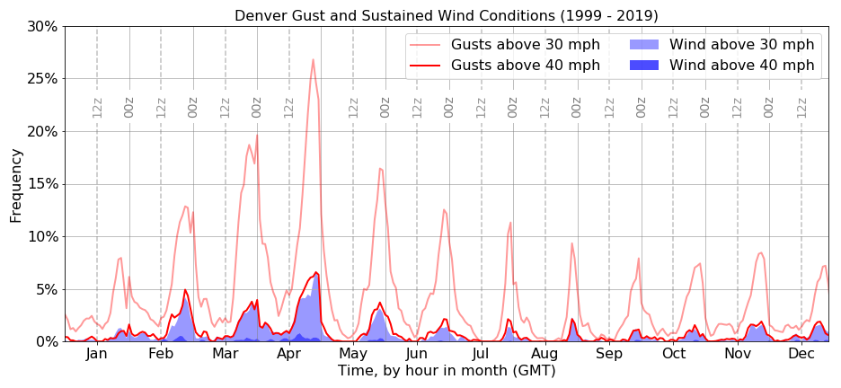

# Frequency of high winds at Denver International Airport

Wind speeds have a significant impact on landing approaches and scheduling at airports, therefore understanding the tendencies of local weather patterns is a significant aspect of planning for airport construction and operation.

## ASOS

The Automated Surface Observing Systems (ASOS) program is operated in part by the National Weather Service and continuously monitors weather conditions at most U.S. airports. These data are freely available at the [Iowa Environmental Mesonet](https://mesonet.agron.iastate.edu/request/download.phtml). Data collection frequency ranges from as often as one observation every five minutes to one per day, depending on the year and time of day; more recent data are likely to have automated systems running 24/7 and recording an observation every 5 to 15 minutes. 

Here I use wind data in _sustained_ and _gust_ categories, both derived from continuous wind speed measurements taken between 27 ft and 33 ft from the runway surface. The reported sustained wind is the average wind speed during the time since the last recorded observation. When wind speeds fluctuate by more than 10 knots (~11.5 mph) in the final 10 minutes of an observing period, the maximum recorded wind speed is reported as a gust.

## Analysis of Denver Int'l Airport

Each observation is assigned a duration equal to the time since its preceeding observation; this is the time window over which its wind speed recordings are valid. Durations of greater than 120 minutes are truncated to 75 minutes so that conditions are not assumed to be known for such long unrecorded durations. The remaining time is effectively dead time for the ASOS system. 

For each month, and for each hour GMT in that month, I divide the total duration of wind speed above a threshold by the total recorded time in that hour and month (in other words, total real time minus total dead time). This returns a frequency by hour-of-day with seasonal patterns accounted for by month-of-year. 

  
 
The analysis can be performed for relevant wind directions as well. For example, an analysis of headwinds of 30 mph can be conducted by multiplying each wind value by the cosine of the difference between ASOS wind direction and runway direction.
