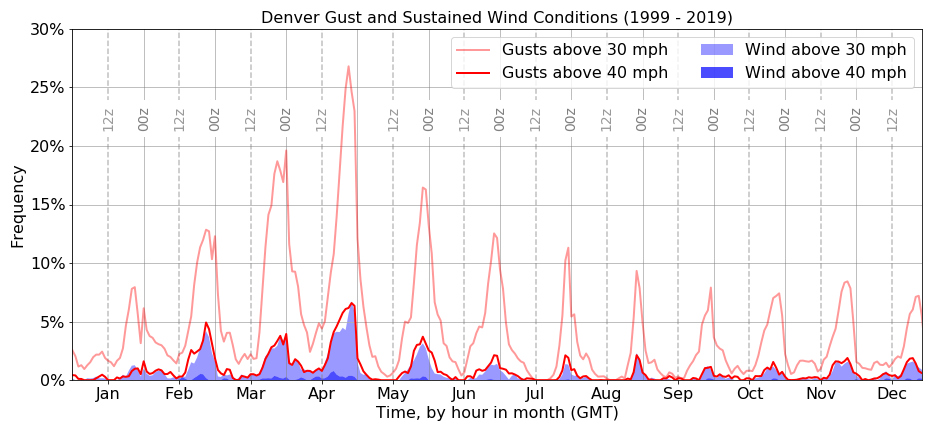

Hello World

# Start migrating documentation here
## so that people know that you do things

# Denver

Wind speed in any direction, showing fraction of time above threshold by hour by month.

  
 
<figure>
	
</figure>

<figure class="half">
    
    
    <figcaption>Caption describing these two images.</figcaption>
</figure>

